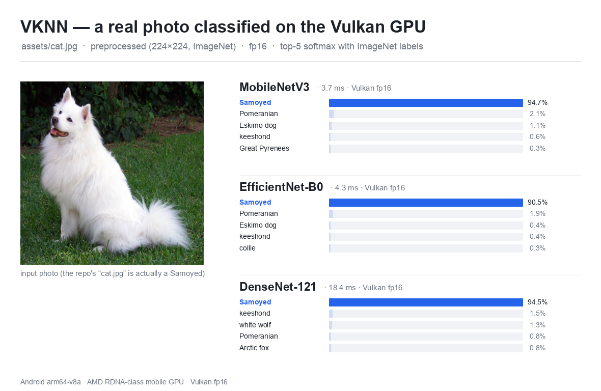

<h1 align="center">VKNN</h1>

<p align="center">
  <b>Vulkan Neural Network</b> — a small, dependency-free C++17 inference engine for neural networks on Android GPUs.
</p>

<p align="center">
  
  
  
  
  
</p>

<p align="center">
  <a href="#quickstart">Quickstart</a> ·
  <a href="#benchmarks">Benchmarks</a> ·
  <a href="#compile-and-run-a-model">Compile &amp; run</a> ·
  <a href="docs/ARCHITECTURE.md">Architecture</a> ·
  <a href="AGENTS.md">Contributing</a>
</p>

**VKNN** (namespace `vknn`) is a small, dependency-free C++17 inference engine for running neural
networks on Android arm64 GPUs through Vulkan compute. It imports an ONNX model with a hand-rolled
protobuf parser, lowers it to a backend-agnostic NCHW IR, runs graph passes (shape inference,
BatchNorm folding, activation/residual fusion, constant folding, dead-node elimination), partitions
the result into maximal same-backend segments, and executes each segment on a pluggable backend.

The primary backend is **Vulkan compute** (NC4HW4 packed layout, one pre-recorded command
buffer per static segment, push descriptors, fp16 storage with fp32 accumulation, DMA-BUF
zero-copy import). A scalar + NEON **CPU backend** is the reference path and the automatic
fallback for ops the GPU declines. Everything is checked end-to-end against onnxruntime
goldens on an Android arm64-v8a device with an AMD RDNA-class mobile GPU.

VKNN runs more than classifiers: image CNNs (ResNet-50, MobileNetV2/V3, EfficientNet,
Inception, DenseNet, ShuffleNet), detection (YOLOv8n), and a 965M-parameter transformer
encoder (the YoNoSplat feed-forward 3D Gaussian Splatting model), plus a from-scratch Vulkan
3DGS rasterizer — all on the GPU.

<p align="center">
  
</p>
<p align="center"><sub>The benchmark CNNs classifying a real photo on the Vulkan GPU (fp16), with top-5 ImageNet labels.</sub></p>

## Highlights

- **No third-party runtime dependencies.** ONNX import is a hand-rolled protobuf parser; the
  only link-time deps are Vulkan + the C++ standard library (+ GoogleTest for the test target).
- **One build entry point** — `./build.sh` (host) / `./build.sh --android` (NDK arm64-v8a).
- **Pluggable backends and operators** via self-registration; adding an op or a backend is a
  new file, no edits to core dispatch.
- **Static, pre-recorded execution.** A model is planned once for a fixed input shape; the
  Vulkan backend records one command buffer per segment and replays it every run.
- **Honest, reproducible numbers.** Every figure comes from on-device runs compared
  against an onnxruntime golden — see [docs/BENCHMARK.md](docs/BENCHMARK.md).

## Benchmarks

VKNN vs [MNN](https://github.com/alibaba/MNN) (Alibaba's production engine), same model, both Vulkan
fp16, thermal-controlled medians. VKNN beats MNN's Vulkan backend across the board:

| Model (Vulkan, fp16) | VKNN | MNN-Vulkan | VKNN vs ORT |
|---|---|---|---|
| MobileNetV2 | 2.3 ms | 13.8 ms | cosine 0.99997 |
| MobileNetV3-Large | 2.8 ms | 17.0 ms | cosine 0.99954 |
| SqueezeNet 1.1 | 1.7 ms | 10.9 ms | cosine 0.99998 |
| EfficientNet-B0 | 4.3 ms | 19.9 ms | cosine 0.99983 |
| ResNet-50 | 10.3 ms | 18.3 ms | cosine 1.000000 |
| Inception-v3 | 15.5 ms | 25.6 ms | cosine 0.99998 |
| YOLOv8n (640×640) | 20.0 ms | ~73 ms | cosine 1.000000 |
| YoNoSplat encoder (965M params) | ~13.5 s | cannot convert | 6 outputs, cosine 0.999+ |

Against MNN's *absolute* best (the min over OpenCL HEAVY-tuned, CPU-4-thread, and Vulkan), VKNN is
faster on **8 of 9** models, and at **parity on the 9th (ResNet-50)** — even though the VKNN number is the
full `run()` wall including host I/O while MNN's is inference-only. The conv-heavy nets (ResNet, Inception,
DenseNet, YOLO) run a tiled-GEMM **Winograd F(2,3)** kernel, autotuned per shape against the direct kernel.
ResNet-50 (was MNN +43%) now matches MNN's OpenCL from a cool device — MNN keeps a slim edge only when the
device is already warm. The 965M-param YoNoSplat transformer encoder runs end-to-end on the GPU, and MNN's
converter can't handle it at all.

**End-to-end, per stage** (ResNet-50, Vulkan fp16, warm). A first result is more than the GPU run —
open the model, build the session, copy in, run, copy out:

| Stage | VKNN | MNN-Vulkan |
|---|---|---|
| open model + create session | ~305 ms | ~960 ms |
| copy in (host→device) | 0.10 ms | not exposed |
| run (inference) | 10.5 ms | 24.2 ms |
| copy out (device→host) | 0.03 ms | not exposed |
| **end-to-end (load + 1 run)** | **~316 ms** | **~985 ms** |

VKNN is ready in ~3× less wall time — MNN-Vulkan spends ~0.9 s compiling pipelines at session
creation, and on this UMA device VKNN's host↔device copies are sub-millisecond. Full methodology, the
per-stage MobileNetV3 numbers, and the OpenCL-tuned comparison: [docs/BENCHMARK.md](docs/BENCHMARK.md).

## Quickstart

**Prerequisites**

- Android NDK **r27** (`27.0.12077973`); set `ANDROID_NDK` if it lives elsewhere.
- `glslc` (shaderc) on `PATH` — compiles the GLSL compute shaders at build time.
- `ninja` and CMake (&ge; 3.22).
- Python 3 with `onnxruntime`, `numpy`, `onnx`, `pillow` — for the golden generators.
- `adb` with a connected arm64-v8a device for the on-device scripts.

```sh
# Host build: CPU backend + IR + ONNX import + tools + tests (no Vulkan needed).
./build.sh

# Android build: full engine incl. the Vulkan backend (NDK arm64-v8a).
./build.sh --android

# Other flags: --clear (wipe build dir first), --convert (model compiler only), --docs (site).
./build.sh --android --clear
```

Run a model with the one-liner tool:

```sh
adb push build-android/vknn_predict /data/local/tmp/vknn/
adb shell /data/local/tmp/vknn/vknn_predict model.onnx input.bin
```

`vknn_classify` adds top-5, golden cosine/top-1 checks, `--bench`, `--profile`, and
`--layer-dump`; `vknn_run_io` is the generic multi-input/multi-output runner. See
[skills/compile-and-run-a-model.md](skills/compile-and-run-a-model.md).

## Minimal API

```cpp
#include "vknn/model.h"

vknn::Model net = vknn::Model::load("mobilenetv2.onnx");  // precision auto, Vulkan if available
vknn::Tensor out = net.run(pixels);                       // pixels = std::vector<float>, NCHW
int cls = out.argmax();
```

`Model::load` reads names, shapes, and dtypes from the model — you never wire tensors by hand.
For full control (backend, precision, caching, zero-copy) use `vknn::Config` with
`Model::load(path, cfg)` or the lower-level `vknn::Session` / `Runtime::load`. See
[docs/CONFIG.md](docs/CONFIG.md).

## Compile and run a model

**1. Compile ONNX → optimized `.vxm`.** `vknn_compile` runs the ONNX import + graph passes once and
writes an optimized, backend-agnostic `.vxm` (weights optionally fp16). Loading a `.vxm` later skips
ONNX parsing and the passes, which pays off for large models.

```sh
./build.sh --convert        # builds vknn_compile only

#   vknn_compile <model.onnx> <out.vxm> [flags]
#   --fp16 + the default fusions (swish, activation+residual into the conv epilogue) = the
#   fully-optimized fp16 build:
./build-host/vknn_compile model.onnx model.vxm --fp16
```

Convert-time flags (separate from the runtime `Config` you pick when you load the `.vxm`):

| Flag | Effect |
|---|---|
| `--fp16` | store weights as fp16 (≈half the file; the GPU path is fp16 anyway) |
| `--no-fuse-swish` | disable folding `x · sigmoid(x)` into the producing Conv (default: on) |
| `--fuse-se` | fuse the Squeeze-Excite chain (experimental) |
| `--fuse-dwpw` | fuse depthwise-3×3 + 1×1-project (experimental) |
| `--dump-big` | log tensors > 50M elements after shape inference (debug) |

You can skip this step and load the `.onnx` directly — the loader auto-detects `.onnx` vs `.vxm`.

**2. Run the compiled `.vxm` on the GPU.** `vknn_run_io` handles **any** number of inputs and
outputs: pass one `.bin` per input (in model order); it writes one `.bin` per output (named by the
output tensor) into the output dir, printing each input/output name + shape as it runs. Vulkan, fp16,
all optimizations (`--opt-level 3` is the default):

```sh
adb push build-android/vknn_run_io model.vxm /data/local/tmp/vknn/
adb shell mkdir -p /data/local/tmp/vknn/out

# a model with TWO inputs -> TWO outputs:
adb shell /data/local/tmp/vknn/vknn_run_io \
    /data/local/tmp/vknn/model.vxm  /data/local/tmp/vknn/out  in0.bin in1.bin \
    --backend vulkan --precision fp16
#   input  'a'  1x3x224x224
#   input  'b'  1x64
#   output 'logits'  1x1000  -> /data/local/tmp/vknn/out/logits.bin
#   output 'embed'   1x512   -> /data/local/tmp/vknn/out/embed.bin
```

Add `--timing` for the pack / submit+gpu / unpack breakdown, `--no-weight-cache` to skip the on-disk
weight cache. The same flow runs the YoNoSplat encoder (2 inputs → 6 Gaussian outputs); see
[skills/run-yonosplat.md](skills/run-yonosplat.md) and
[skills/compile-and-run-a-model.md](skills/compile-and-run-a-model.md).

**3. …or drive it from C++.** `vknn::Model` reads each input/output name and shape from the model — you
only supply data. Vulkan, fp16, maximum autotuning, all fusions; **two inputs → two outputs**:

```cpp
#include "vknn/model.h"
#include <cstdio>
#include <fstream>
#include <vector>

// Read a raw fp32 .bin into a float vector.
static std::vector<float> readBin(const char* path) {
  std::ifstream f(path, std::ios::binary | std::ios::ate);
  size_t n = f ? (size_t)f.tellg() / sizeof(float) : 0;
  std::vector<float> v(n);
  if (f) { f.seekg(0); f.read(reinterpret_cast<char*>(v.data()), n * sizeof(float)); }
  return v;
}

int main() {
  vknn::Config cfg;
  cfg.backend   = vknn::BackendKind::kVulkan;    // run on the GPU (CPU is the implicit fallback)
  cfg.precision = vknn::Precision::kFp16;        // fp16 storage, fp32 accumulation
  cfg.tuning    = vknn::TuningLevel::kThorough;  // maximum autotuning (cached to cfg.cacheDir)
  cfg.optLevel  = 3;                             // all graph fusions (the default)

  vknn::Model net = vknn::Model::load("model.vxm", cfg);  // auto-detects .vxm vs .onnx
  if (!net) { fprintf(stderr, "failed to load model\n"); return 1; }

  // Two inputs — names + shapes come from the model; you supply only the data.
  auto in = net.inputs();
  vknn::Tensor a(readBin("in0.bin"), in[0].shape, in[0].name);
  vknn::Tensor b(readBin("in1.bin"), in[1].shape, in[1].name);

  // Run: two inputs -> two outputs.
  std::vector<vknn::Tensor> outs = net.run({a, b});

  for (const vknn::Tensor& o : outs)
    printf("output '%s'  %s  max=%.4f\n", o.name().c_str(), o.shapeString().c_str(), o.max());

  // ...or fetch a specific output by name:
  if (const vknn::Tensor* y = vknn::findTensor(outs, net.outputs()[0].name))
    printf("argmax of '%s' = %lld\n", net.outputs()[0].name.c_str(), (long long)y->argmax());
  return 0;
}
```

Link the static lib **whole-archive** so the self-registering operators/backends survive — the simplest
path is to drop the `.cpp` in `examples/` and add its name to the `examples` list in `CMakeLists.txt`
(it already links whole-archive). For finer control, the lower-level `vknn::Session` / `IOTensor` API
in [`include/vknn/session.h`](include/vknn/session.h) takes the same `Config`.

## Repo layout

```
include/vknn/          public headers (model, session, config, backend, op, tensor, graph, ...)
src/core/              session, graph, passes glue, config/JSON, profiler, ion (dma-buf), logging
src/import/onnx/       dependency-free ONNX protobuf parser
src/import/passes.*    graph passes (inferShapes, foldBatchNorm, fuseActivations, constFold, ...)
src/backend/vulkan/   VulkanBackend: context, buffers, command/pipeline, NC4HW4 + flat ops, autotune
src/backend/cpu/      CpuBackend: scalar reference + NEON; one op per file under ops/
shaders/               GLSL compute (.comp) + common.glsl/precision.glsl; compiled by glslc, embedded
convert/               vknn_compile — the ONNX -> .vxm model compiler
examples/              example/tool binaries (built as vknn_*)
tests/                 GoogleTest core + integration -> vknn_tests
scripts/               build_android shim, run_on_device, bench, gen_docs, get_golden, yonosplat/
tools/                 embed_spirv.py (SPIR-V -> vknn::embeddedShaders()), compare_layers.py
docs/                  ARCHITECTURE, ADDING_*, CONFIG, LIMITATIONS, BENCHMARK, OP_COVERAGE, adr/
```

## Binaries

All build as `vknn_*` under `build-android/` (and on the host where Vulkan is unavailable). Each
links the static lib whole-archive so self-registering backends and operators survive.

| Binary | Source | What it does |
|---|---|---|
| `vknn_probe` | `examples/probe.cpp` | Enumerates the device's Vulkan compute caps (driver, fp16/int8, subgroup size, queues, extensions). |
| `vknn_classify` | `examples/classify.cpp` | Loads ONNX, runs an input, prints top-5; optional golden cosine/top-1, `--bench`, `--profile`, `--layer-dump`. |
| `vknn_predict` | `examples/predict.cpp` | The friendly `Model` API in action: load, run, read the result. |
| `vknn_run_io` | `examples/run_io.cpp` | Generic runner: any model, named inputs in / outputs dumped to a dir. |
| `vknn_compile` | `convert/compile.cpp` | ONNX -> optimized `.vxm` model compiler (fp16, fusions). |
| `vknn_profile` | `examples/profile.cpp` | Runs with the profiler on: per-op timing table, JSON, Chrome trace. |
| `vknn_ion_zerocopy` | `examples/ion_zerocopy.cpp` | DMA-BUF zero-copy import into Vulkan, verified against the staged path. |
| `vknn_backend_switch` | `examples/backend_switch.cpp` | Selects the backend via `Config` (Vulkan / CPU) and shows per-node routing. |
| `vknn_yonosplat` | `examples/yonosplat.cpp` | The full YoNoSplat 3DGS pipeline: encoder -> Gaussians -> Vulkan rasterizer -> image. |
| `vknn_tests` | `tests/*.cpp` | GoogleTest core IR/passes + import-to-run pipeline (host or device). |

## Documentation

Build the static documentation site (one self-contained page set):

```sh
./build.sh --docs        # -> docs/site/index.html
```

Key reference docs:

- [docs/ARCHITECTURE.md](docs/ARCHITECTURE.md) — import &rarr; IR &rarr; passes &rarr; segments &rarr; backends, and the NC4HW4 compute path.
- [docs/ADDING_AN_OPERATOR.md](docs/ADDING_AN_OPERATOR.md) — add a CPU or Vulkan op via the self-registration macros.
- [docs/ADDING_A_BACKEND.md](docs/ADDING_A_BACKEND.md) — implement and register a new `Backend`.
- [docs/CONFIG.md](docs/CONFIG.md) — every `vknn::Config` field and its JSON form.
- [docs/OP_COVERAGE.md](docs/OP_COVERAGE.md) — the operator set and its backend coverage.
- [docs/LIMITATIONS.md](docs/LIMITATIONS.md) — supported operators, known gaps, single-device caveat.
- [docs/BENCHMARK.md](docs/BENCHMARK.md) — on-device VKNN vs MNN numbers and methodology.
- [docs/adr/](docs/adr/) — architecture decision records.
- [AGENTS.md](AGENTS.md) + [skills/](skills/) — orientation and focused how-to guides for contributors (and AI agents).

## Extending

Self-registration works because the static lib is linked whole-archive
(`$<LINK_LIBRARY:WHOLE_ARCHIVE,vknn>`); no edits to core dispatch are needed. Note the
**one operator per file** convention under `src/backend/{cpu,vulkan}/ops/`.

- **CPU op:** subclass `vknn::CpuOp` and `VKNN_REGISTER_CPU_OP(OpType::kFoo, FooCpuOp)`.
- **Vulkan op:** subclass `vknn::VulkanOp` (implement `prepare()` / `record()`), add a GLSL
  `.comp` under `shaders/`, and `VKNN_REGISTER_VK_OP(OpType::kFoo, FooVulkanOp)`.
- **Backend:** subclass `vknn::Backend` and `VKNN_REGISTER_BACKEND(BackendKind::kFoo, FooBackend)`.

## Tests

The unit/integration tests build and run **on the host** (no Vulkan / NEON required):

```sh
./build.sh                 # configures + builds build-host, including vknn_tests
./build-host/vknn_tests
```

`vknn_tests` covers the core IR/passes (`tests/test_core.cpp`) and the import-to-run pipeline on
the CPU backend (`tests/test_integration.cpp`). The same binary also builds for the device.

## License

See [LICENSE](LICENSE).
