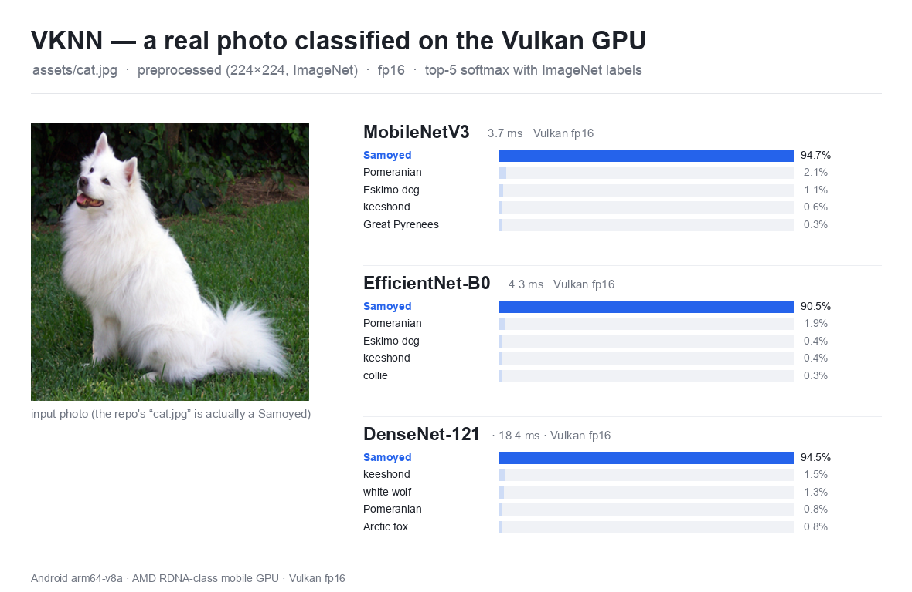

<h1 align="center">VKNN</h1>

<p align="center">
  <b>Vulkan Neural Network</b> — a small, dependency-free C++17 inference engine that runs ONNX models on Android GPUs.
</p>

<p align="center">
  
  
  
  
  
</p>

<p align="center">
  <a href="#what-it-does">What it does</a> ·
  <a href="#quickstart">Quickstart</a> ·
  <a href="#feature-matrix">Features</a> ·
  <a href="#benchmarks">Benchmarks</a> ·
  <a href="#documentation">Docs</a>
</p>

## What it does

**VKNN** (namespace `vknn`) is an on-device inference engine: you give it an ONNX model, and it runs
on the **Android GPU** (Vulkan compute) with a scalar + NEON
**CPU backend** as the reference path and automatic fallback. It imports the model with a hand-rolled
protobuf parser, lowers it to an NCHW IR, runs graph passes (shape inference, BatchNorm folding,
activation/residual fusion, pointwise-chain fusion into producer epilogues, quantized-node
dequantization, constant folding), partitions the graph into maximal same-backend segments, and
executes each on a pluggable backend. The Vulkan path uses an NC4HW4 packed layout, pre-recorded
command buffers per segment, fp16 storage with fp32 accumulation, and caller-owned DMA-BUF I/O. There
are **no third-party runtime dependencies** — only Vulkan and the C++ standard library — and every
result is checked against an onnxruntime golden.

It runs image CNNs (ResNet-50, MobileNetV2/V3, EfficientNet, Inception, DenseNet, ShuffleNet),
detection (YOLOv8n), an autoregressive LLM (Qwen2.5-Coder-0.5B), a 2.2B vision-language model
(SmolVLM2 — vision tower + decoder prefill/decode shipped as **one multi-graph `.vxm`**), and a
965M-parameter transformer encoder (the YoNoSplat feed-forward 3D Gaussian Splatting model) plus a
from-scratch Vulkan 3DGS rasterizer — all on the GPU.

<p align="center">
  
</p>
<p align="center"><sub>The benchmark CNNs classifying a real photo on the Vulkan GPU (fp16), with top-5 ImageNet labels.</sub></p>

## Quickstart

Build the engine and tools:

```sh
./build.sh             # host build: CPU backend + IR + ONNX import + tools + tests (no Vulkan)
./build.sh --android   # full engine incl. the Vulkan backend (NDK r27 arm64-v8a)
./build.sh --docs      # the static documentation site -> docs/site/index.html
```

**Compile once, run many times.** `vknn_compile` turns an ONNX model into an optimized `.vxm` that
skips ONNX parsing and graph passes at load:

```sh
# model.onnx -> model.vxm.  --fp16 halves the file + host upload; --shape resolves a dynamic input.
vknn_compile model.onnx model.vxm --fp16 --shape input=1x3x224x224
```

Push the model and run it on the device:

```sh
adb push build-android/vknn_classify model.vxm input.bin /data/local/tmp/vknn/
adb shell /data/local/tmp/vknn/vknn_classify --model model.vxm --input input.bin \
    --backend vulkan --precision low --bench 20
```

`--precision` is a quality tier: **`low`** (fp16 storage + fp32 accumulation), **`normal`** (fp16 with
a precision-critical geometry tail kept fp32), or **`high`** (full fp32).

**Or from C++.** The model reports its own input/output names and shapes — you supply only the data.
This is [`examples/basics/readme_quickstart.cpp`](examples/basics/readme_quickstart.cpp), compiled by the build:

```cpp
#include "vknn/model.h"

vknn::Config cfg;
cfg.backend   = vknn::BackendKind::Vulkan;  // run on the GPU (CPU is the implicit fallback)
cfg.precision = vknn::Precision::Low;       // fp16 storage, fp32 accumulation

vknn::Model net = vknn::Model::load("model.vxm", cfg);  // auto-detects .vxm vs .onnx
if (!net) {
  return 1;
}

// Names + shapes come from the model; you supply only the data.
auto in = net.inputs();
vknn::Tensor input(pixels, in[0].shape, in[0].name);    // pixels: std::vector<float>, NCHW

std::vector<vknn::Tensor> outputs = net.run({input});   // one input in, every output back

const vknn::Tensor& y = outputs.front();
int cls = (int)y.argmax();
```

Link the static lib **whole-archive** so the self-registering operators/backends survive; dropping a
`.cpp` into `examples/` and adding it to the `_vknn_examples` list in `CMakeLists.txt` already does
this. Everything is configured through `vknn::Config` — the engine reads **no environment variables**
([docs/config.md](docs/config.md)).

## Chat with an LLM

VKNN runs **Qwen2.5-Coder-0.5B** (a `qwen2` autoregressive decoder) end to end with **every compute
op on the GPU — zero CPU fallbacks**, generating text that matches the HuggingFace greedy reference
token-for-token. A small terminal chat app drives it: [`examples/llm/chat.cpp`](examples/llm/chat.cpp) owns
the on-device GPU decode loop (fixed-context KV cache, token streaming) and
[`examples/llm/chat_host.py`](examples/llm/chat_host.py) is the one host dependency (HuggingFace tokenizer +
REPL). Asking it a question:

```text
user>  Write a Python function to check if a number is prime.
model> def is_prime(n):
           if n <= 1:
               return False
           if n <= 3:
               return True
           if n % 2 == 0 or n % 3 == 0:
               return False
           i = 5
           while i * i <= n:
               if n % i == 0 or n % (i + 2) == 0:
                   return False
               i += 6
           return True
```

The autoregressive decode step is fused at load: the rotate-half RoPE chains collapse into one `Rope`
dispatch per q/k site, and the single-query attention core (MatMul → scale/mask → Softmax → MatMul)
fuses into one `FusedAttention` kernel per layer that reads the GQA KV cache through per-axis
operand-view strides — no materialized `repeat_kv`. Both passes run at load only and never rewrite a
compiled `.vxm`, so existing models speed up on load; each is gated by a `Config` hint with a `--no-*`
flag. Greedy decode registers the logits output for an engine-side argmax (`Session::setOutputArgMax`
/ `readOutputArgMax`), so the next-token id comes back as 8 bytes from a GPU reduction instead of a
full download and scan of the 151936-wide logits row (the token stream is unchanged — first-occurrence
argmax). Together they cut the engine host loop from ~9 ms to ~0.5 ms per token; the int4 Qwen instruct
model decodes a token in a ~19.7 ms GPU span at a 1024-token context. Its
[`qwen-vknn`](https://huggingface.co/katolikov/qwen-vknn) repo ships a 517 MB int4 build — with a
256-token whole-window prefill bucket — next to the fp16 export.

Full walkthrough (export → compile → run + more examples): [docs/running-an-llm.md](docs/running-an-llm.md)
and the [Running an LLM on VKNN](https://github.com/katolikov/vknn/wiki/Running-an-LLM-on-VKNN) wiki page.

## Show it a picture

**SmolVLM2-2.2B** vision-language chat runs full-GPU from **one multi-graph `.vxm`**: the SigLIP
vision tower, the token embedding, and the text decoder's prefill + decode plans compile into a
single file over a content-deduped weight pool
([hf.co/katolikov/smolvlm2-vknn](https://huggingface.co/katolikov/smolvlm2-vknn)), and the session
dispatches each `run()` to the right graph by its bound input names + shapes.
[`examples/llm/vlm.cpp`](examples/llm/vlm.cpp) drives the device loop (image encode → on-device
embedding splice → prefill → streamed decode) with
[`examples/llm/vlm_host.py`](examples/llm/vlm_host.py) as the host front-end. On a current flagship
phone GPU it answers questions about a photo at 6–7.5 tokens/s with a 0.85 s prefill, matching the
fp32 onnxruntime reference token-for-token. The repo publishes a 1.35 GB int4 build of the model
alongside the 4.5 GB fp16 one. Walkthrough: [docs/running-a-vlm.md](docs/running-a-vlm.md).

The same models power [`app-demo/`](app-demo/) — an Android app (Kotlin/Compose over JNI) with four
tabs: **Chat**, **VLM** camera coach, **3D Splat** capture, and a **Library** that downloads each
`.vxm` from HuggingFace. The Chat and VLM tabs each carry a per-tab model-variant picker (fp16 / int4).

## Feature matrix

| Capability | What VKNN does |
|---|---|
| **Backends** | Vulkan compute GPU (primary) + scalar/NEON CPU (reference & automatic fallback), selected per segment. |
| **Full-GPU op coverage** | Every *executable* operator has a Vulkan kernel; a whole benchmark model runs on the GPU with **0 CPU fallbacks**. Only data-dependent control flow (`Loop` / `If` / `NonMaxSuppression`) and const-folded import ops stay off the GPU. See [docs/op-coverage.md](docs/op-coverage.md). |
| **Precision** | fp16 storage + fp32 accumulation (`low`), selective-fp32 geometry tail (`normal`), or full fp32 (`high`). Stores rounded to nearest even; every path checked against an onnxruntime golden. |
| **Dynamic shapes** | Declared shape **plan buckets**: `vknn_compile --shape NAME=D0xD1x...` / `--bucket "..."` bakes one plan per shape set; at runtime `Session::prepareShapes()` compiles more, and `run()` selects a bucket by the bound input shapes. A fixed-shape model is one bucket (a single map lookup on the hot path). |
| **Multi-graph `.vxm`** | `vknn_compile --graph "FILE[;shape/dim segments]"` (repeatable) compiles **several source graphs** — or one graph at several shapes — into one `.vxm` over a content-deduped weight pool; `run()` dispatches to the bucket matching the bound input names + shapes. Buckets stream at load (host peak = one bucket's weights) and share GPU weight copies by content, so a whole VLM (vision tower + embedding + decoder prefill/decode) is one file and one session. See [docs/running-a-vlm.md](docs/running-a-vlm.md). |
| **Quantized models** | QDQ / QLinear / dynamic-quant checkpoints load and run: quantized nodes are **dequantized to float** at import (saturation clamps preserved), so a quantized export runs without a separate float model. `--no-dequantize` opts out. `vknn_compile -Os` goes the other way and **produces** int4 — all fusion plus calibration-free int4 weight quantization (AWQ outlier columns kept fp16, per-layer error guard) over a native int4 GPU MatMul; the Qwen instruct weights come out ~2.4× smaller, and every bucket of a multi-graph `.vxm` is requantized. |
| **Autotuned kernels** | Load-time GEMM/conv-kernel autotuning (`--tuning none`/`fast`/`heavy`); the chosen kernels + prepacked/Winograd weights are cached per model, so a warm load skips shader compilation, prepacking, and tuning. Tuning optimizes for **speed**: on a convolution-heavy model it may pick a Winograd variant whose fp16 rounding differs from the default direct/GEMM kernels, so the exact output — and its PSNR/SNR against an fp32 reference — shifts with the tuning level and can differ across devices (the argmax / detections do not). `--tuning none --no-cache` runs the default kernel on every device (bit-identical GPU output) and, because the untuned kernels carry less transform rounding, often lands *closer* to the fp32 reference — trading some speed for the most reproducible and accurate result. (`--tuning none` on its own still *reuses* a cached fast/heavy tune when one is present — it means "run no new sweep", not "ignore a stored one" — so pin `--no-cache` too for the bit-identical guarantee.) |
| **Zero-copy I/O** | Caller-owned DMA-BUF fds bind straight to the GPU boundary buffer (no host copy) via `Tensor::fromDmaBuf` / `toDmaBuf`, with a declared layout/dtype the GPU converts on the fly when it differs from device-native. See [`examples/io/dmabuf_fd_io.cpp`](examples/io/dmabuf_fd_io.cpp). |
| **Warm-start cache** | A self-validating, multi-variant per-model `.cache` (kernel hash + device + config) auto-heals across driver/model/code changes. |
| **Tools** | `vknn_compile` (ONNX → `.vxm`, with `--support-report <out.json>` for the per-node backend assignment), `vknn_run_io` (any multi-input/multi-output model), plus the example runners below. |

## Benchmarks

VKNN vs [MNN](https://github.com/alibaba/MNN) (Alibaba's production engine), same model, same device,
fp16, thermal-controlled medians — against both of MNN's GPU backends (Vulkan, and OpenCL with HEAVY
autotuning, its strongest path here):

| Model (fp16) | VKNN | MNN-Vulkan | MNN-OpenCL (HEAVY) | VKNN vs ORT |
|---|---|---|---|---|
| MobileNetV2 | 2.3 ms | 13.8 ms | 3.1 ms | cosine 0.99997 |
| MobileNetV3-Large | 2.8 ms | 17.0 ms | 6.4 ms | cosine 0.99954 |
| SqueezeNet 1.1 | 1.7 ms | 10.9 ms | 2.6 ms | cosine 0.99998 |
| EfficientNet-B0 | 4.3 ms | 19.9 ms | 9.3 ms | cosine 0.99983 |
| ResNet-50 | 10.3 ms | 18.3 ms | 10.3 ms | cosine 1.000000 |
| Inception-v3 | 15.5 ms | 25.6 ms | 19.6 ms | cosine 0.99998 |
| YOLOv8n (640×640) | 20.0 ms | ~73 ms | 24.5 ms | cosine 1.000000 |
| YoNoSplat encoder (965M params) | 17.0 s | cannot convert | cannot convert | 6 outputs, cosine 0.99999 |

The VKNN figure is the full `run()` wall (it includes the host↔device copies); MNN's is inference-only.
Against MNN's absolute best (min over OpenCL-HEAVY, CPU-4-thread, Vulkan), VKNN is faster on **8 of 9**
models and at **parity on ResNet-50**. Methodology, per-stage timings, and the OpenCL-tuned comparison:
[docs/benchmark.md](docs/benchmark.md).

The accuracy column is measured with autotuning on; because tuning selects kernels for speed, a
convolution-heavy model's exact cosine/PSNR moves a little with the tuning level and across devices
(see **Autotuned kernels** above). Pin `--tuning none --no-cache` for a bit-identical, device-independent
— and typically marginally more accurate — result.

## Supported operators

A broad ONNX op set: convolution/pooling, the elementwise unary/binary families, MatMul (batched N-D),
Gemm, LayerNorm, Softmax, Einsum, RoPE, Gather/Scatter, Resize, Pad, GridSample, Range, the
QDQ/QLinear quantization ops (dequantized at import), and the shape/data-movement ops — enough for
CNNs, detection, and transformer/attention models. The load-time decode passes additionally synthesize
a `Rope` and a fused single-query attention op that are created in-engine rather than parsed from ONNX.
Per-op GPU/CPU coverage:
[docs/op-coverage.md](docs/op-coverage.md). Adding an op is one new file via the self-registration
macros: [docs/adding-an-operator.md](docs/adding-an-operator.md).

## Documentation

- [docs/architecture.md](docs/architecture.md) — import → IR → passes → segments → backends, and the NC4HW4 compute path.
- [docs/config.md](docs/config.md) — every `vknn::Config` field, the `setHint` API, and the JSON form.
- [docs/op-coverage.md](docs/op-coverage.md) — the operator set and its backend coverage.
- [docs/benchmark.md](docs/benchmark.md) — on-device VKNN vs MNN numbers and methodology.
- [docs/limitations.md](docs/limitations.md) — known gaps, dynamic-shape buckets, quantization, and the single-device caveat.
- [docs/adding-an-operator.md](docs/adding-an-operator.md) · [docs/adding-a-backend.md](docs/adding-a-backend.md) — extend the engine (one new file, no core edits).
- [docs/adr/](docs/adr/) — architecture decision records.
- [AGENTS.md](AGENTS.md) + [skills/](skills/) — orientation and focused how-to guides.

Runnable examples live in [`examples/`](examples/): `readme_quickstart` (load-set-run-read),
`zerocopy_simple` / `zerocopy_cache` and `dmabuf_fd_io` (caller-owned DMA-BUF I/O), `run_io` (generic
multi-I/O), `classify` / `predict` (CNN classifiers), `chat` / `vlm` (LLM and VLM device loops), and
`yonosplat` (the transformer encoder + rasterizer). [`app-demo/`](app-demo/) wraps the LLM, VLM, and
splatting paths in a four-tab Android app.

## License

MIT — see [LICENSE](LICENSE).
