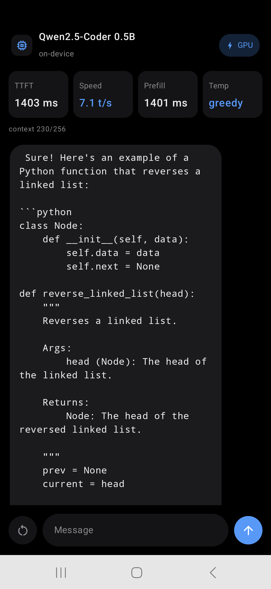

# VKNN — on-device GPU inference demo (Android)



An Android app with three modes over the VKNN engine — **Chat** (Qwen2.5-Coder-0.5B), **VLM**
camera coach (SmolVLM2-2.2B: point the camera, take a photo, the model answers), and **3D Splat**
capture (YoNoSplat: arc the phone over 8 guided frames, then orbit the reconstructed
Gaussian-splat scene) — plus a **Model Library** that downloads each mode's `.vxm` from
HuggingFace with pause/resume (HTTP Range, survives process death), sha256 verification against
the HF blobs API, free-space and metered-network guards, per-model delete, and a global
inference-backend switch (Vulkan default; CPU allowed only where the fp32 working set fits RAM).
The Chat and VLM tabs carry a **model-variant picker** (fp16 / int4, plus any ad-hoc `.vxm`
already in app storage), filtered by mode so a tab only offers models of its own family — Chat
lists the Qwen variants, VLM the SmolVLM2 variants (fp16 and int4). The choice persists and
switching swaps the resident session through the single-residency slot. Everything runs **on
device** (Vulkan) with live latency metrics.
Native-style dark theme. Kotlin + Jetpack Compose over a JNI bridge; no cloud, no server.

## Layout
```
app-demo/
  native/                 JNI bridge -> libvknnchat.so
    vknn_jni.cpp          Decoder (llm/chat.cpp) + Vlm (llm/vlm.cpp) + Splat (splatting/raster_core) handles
    CMakeLists.txt        links the static vknn engine (WHOLE_ARCHIVE) + Vulkan; shaders are embedded
    build_native.sh       cross-builds the .so for arm64-v8a into app/src/main/jniLibs/
  app/                    the Android app (Kotlin + Compose)
    src/main/java/com/vknn/chat/
      NativeLib.kt          JNI bindings (chat decoder + VLM)
      Tokenizer.kt          pure-Kotlin byte-level BPE (Qwen2 and SmolVLM2 pipelines)
      model/                model library: catalogue (fp16/int4 variants) + resumable sha256-verified
                            HF downloads, per-tab variant selection, backend setting + CPU-admission
                            policy
      vlm/                  SmolVLM2 prompt template, pixel normalization, camera-coach view model
      splat/                YoNoSplat capture/orbit view model + pose math
      ChatViewModel.kt      encode -> prefill -> stream decode, with metrics
      MainActivity.kt, ui/  Compose shell: Chat / VLM / 3D Splat tabs + Model Library, dark theme
    src/main/assets/        vocab.json + merges.txt (the Qwen tokenizer ships in the APK; the
                            SmolVLM2 tokenizer downloads with its model)
    src/test/               JVM tests: both BPE pipelines match HuggingFace; HF API parsing;
                            catalogue invariants; CHW normalization; vlm_gate prompt-id gate
```

## Build
Prerequisites: Android SDK + NDK (r27), a cmake >= 3.24 on `PATH` (for the native step), and a JDK 17+.

```sh
# 1. build the native engine bridge into the app's jniLibs
app-demo/native/build_native.sh                 # -> app/src/main/jniLibs/arm64-v8a/libvknnchat.so

# 2. build the APK
cd app-demo && ./gradlew :app:assembleDebug     # -> app/build/outputs/apk/debug/app-debug.apk

# 3. install
adb install -r app-demo/app/build/outputs/apk/debug/app-debug.apk
```

Run the tokenizer check on the JVM (no device needed): `./gradlew :app:testDebugUnitTest`.

## How each mode works

**Chat** — a with-past Qwen2 decoder compiled at a fixed context length (**C = 1024** for the
catalogue variants); the KV cache lives in the `past_key_values` boundary buffers. The app
tokenizes your text (byte-level BPE) and hands the whole prompt to the native `Decoder`: a
multi-bucket `.vxm` (the "fast prefill" variants) ingests it in 256-token batched forwards through
its prefill bucket, a single-bucket model feeds it token by token; decode then streams one
GPU step per token. Sampling is greedy or temperature + top-k/top-p — and a greedy session
registers the decode logits for the engine-side argmax (`Session::setOutputArgMax`), so each token
reads back 8 bytes instead of the vocab row (temperature sampling then applies after a reload).
Every tensor-compute op runs on Vulkan; only argmax/sampling and tokenization are CPU. Metrics are
wall-clock around the native calls. The compiled `.vxm` reproduces the HuggingFace greedy stream
token-for-token (see the repo's `docs/running-an-llm.md`).

**VLM** — SmolVLM2-2.2B as **one multi-graph `.vxm`** (vision encoder, token embedding, and decoder
prefill + decode buckets over one shared weight pool; see the repo's `docs/running-a-vlm.md`),
selectable in fp16 (4.5 GB) or **int4** (1.35 GB, ~1/3 the GPU-memory footprint). A photo runs the
vision bucket once (81 image-embedding rows), the rows splice into the embedded prompt on device,
the prompt prefills in a single 128-token pass, and decode streams token by token. The camera coach
asks a pinned question about the current frame and shows the streamed answer.

**3D Splat** — 8 guided capture frames feed the YoNoSplat encoder (one GPU pass → Gaussian splats),
and the engine's Vulkan rasterizer (`examples/splatting/raster_core`, linked into the JNI bridge)
renders the orbit viewer from the reconstructed scene.

## Memory requirements

arm64-v8a only; requires a Vulkan-capable device. Model downloads: Qwen 1.3 GB fp16 (0.5 GB as
int4), SmolVLM2 4.5 GB, YoNoSplat encoder 2.3 GB. Running SmolVLM2 on Vulkan needs **~4.6 GB of
GPU-addressable memory**.
The CPU backend decodes fp16 weights to fp32 host-side, so it needs roughly **2× the model file in
RAM**; the app blocks the CPU choice when that working set exceeds half of device RAM (SmolVLM2's
~9 GB fp32 working set is blocked on current phones — the library shows the reason instead of
letting the load take down the device).
